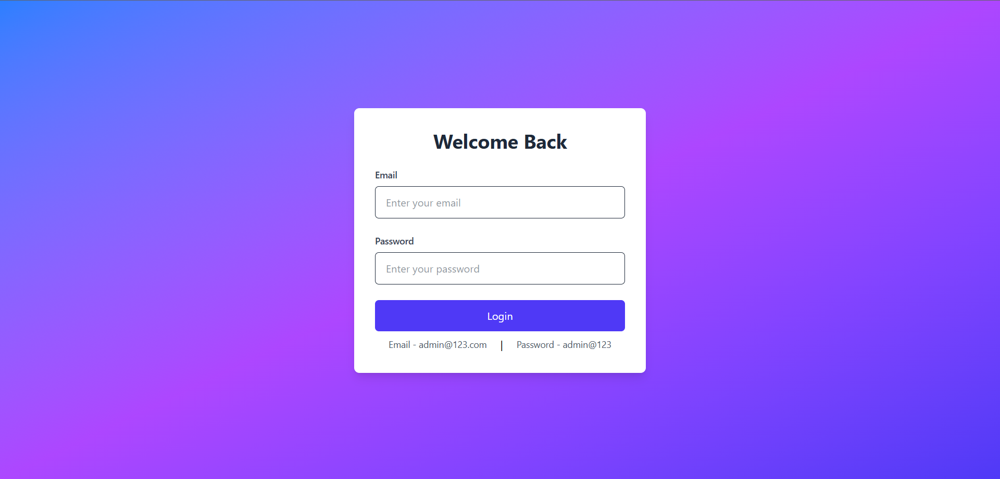
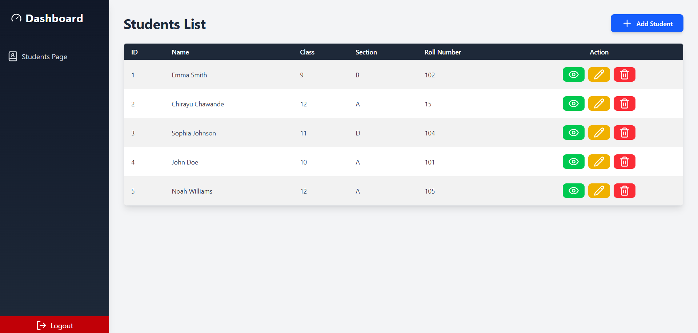

# Student Dasboard

This project is a React-based web application. It includes a simple login system, a student management dashboard, and integration with Firebase for authentication and Firestore for data storage.  

## Features  

### 1. Login Page  
- A basic login page with Firebase authentication.  
- Predefined credentials for login:  
  - **Username:** admin@123.com  
  - **Password:** admin@123  

### 2. Students Page  
- A table displaying a list of students with the following columns:  
  - **ID**  
  - **Name**  
  - **Class**  
  - **Section**  
  - **Roll Number**  
  - **Action** (View, Edit, Delete icons for each row)  

- Includes an **"Add Student"** button:  
  - Opens a modal with a student information form.  
  - The form has 12+ fields to capture student details.  
  - On form submission, data is saved to the Firestore database.  

### 3. Sidebar Navigation  
- **Students Page:** Navigates to the Students page.  
- **Logout:** Logs out the current user and redirects to the Login page.  

### 4. Deployment  
- The application is deployed and accessible via the following link:  
  [Deployed Link](https://student-dashboard-murex.vercel.app/)  

### Installation

1. Clone the repository:
   ```bash
   git clone https://github.com/ChirayuC01/student-dashboard.git
   ```
2. Navigate to the project directory:
   ```bash
   cd student-dashboard
   ```
3. Install dependencies:
   ```bash
   npm install
   ```
4. Add environment variables:
   - Create a ```.env``` file in the root directory and add the following:
  
        ```go
        VITE_apiKey = your_apiKey
        VITE_authDomain = your_authDomain
        VITE_projectId = your_projectId
        VITE_storageBucket = your_storageBucket
        VITE_messagingSenderId = your_messagingSenderId
        VITE_appId = your_appId
        ```
    - Replace the placeholder values with your Firebase project credentials from the Firebase Console.
5. Start the development server:
   ```bash
   npm run dev
   ```
6. To build the project for production:
   ```bash
   npm run build
   ```

## Technologies Used

- **Vite**: Fast build tool for modern web apps.
- **React**: JavaScript library for building user interfaces.
- **Tailwind CSS**: Utility-first CSS framework for styling.
- **Firebase Authentication**: Provides a secure and easy-to-implement authentication system for managing user sign-ins.
- **Firestore**: A cloud-hosted NoSQL database for real-time and scalable data storage.
- **Lucide-react**: A library of customizable React icons, perfect for adding modern and elegant icons to the UI.
- **Vercel**: A platform for deploying and hosting web applications with fast global performance.

## Screenshots

### Login


### Home


### Add Student


### View Student Details


### Edit Student Details


### Delete Student Details

